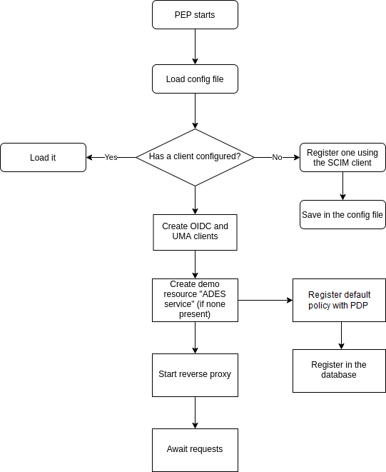
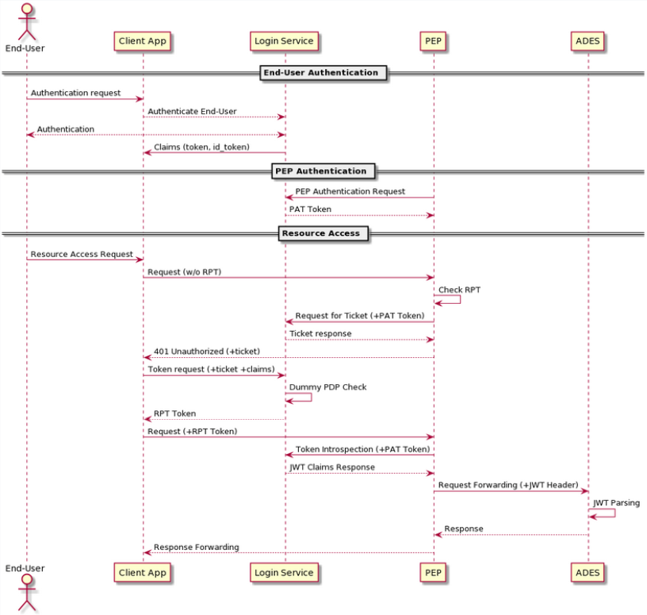

[[mainOverview]]
= Overview

== Building Block Overview

[NOTE]
.Content Description
================================
This section contains:

* High-Level Description of the Building Block
* Context within EOEPCA
================================

The main functionality of the PEP is to be able to stand between a client and the client's desired resource. By creating this setup, where only the PEP is visible to an external request, we effectively secure whatever is behind the PEP. The PEP will enforce any policy for a resource configured in the Authorization Server, following the UMA 2.0 standard.

When launched, the PEP will answer to all requests that start with the configured path. These answers will come in the form of UMA tickets (if there are no RPT provided, or an invalid one is used).
In case the request is accompained by a header using a valid RPT in the format `Authorization: Bearer <valid_RPT>`, the PEP will make a request to the resource server, for the resource located exactly at the path requested (minus the configured at config), and return the resource's server answer.

Examples follow, assuming the following conditions:

- path configured for the reverse proxy is "/pep"
- the PEP is at pep.domain.com/pep
- Resource server is at remote.server.com

[cols="4*"]
|===
| Token | Request to PEP | PEP Action | PEP answer

| No RPT | pep.domain.com | None (request does not get to PEP endpoint) | None (the PEP doesn't see this request) 
| No RPT | pep.domain.com/pep/thing | Generate ticket for "/thing" | 401 + ticket 
| Valid RPT for "/thing" | pep.domain.com/pep/thing | Request to remote.server.com/thing | Contents of remote.server.com/thing 
| Valid RPT for "/thing" | pep.domain.com/pep/different | Generate ticket for "/different" | 401 + ticket 
| INVALID RPT for "/thing" | pep.domain.com/pep/thing | Generate ticket for "/thing" | 401 + ticket 
| No RPT | pep.domain.com/pep/thing/with/large/path | Generate ticket for "/thing/with/large/path" | 401 + ticket 
| Valid RPT for "/thing/with/large/path" | pep.domain.com/pep/thing/with/large/path | Request to remote.server.com/thing/with/large/path | Contents of remote.server.com/thing/with/large/path

|===

To further clarify the flow the PEP uses, you can also take a look at the Data Flow in section <<Data flow>>

=== Initialization flow

== External Interfaces

=== Exposed Interfaces

==== HTTP(S) (Reverse Proxy Listener)
An HTTP listener, which can be configured through the config file.
This is the only input interface to interact directly with the PEP from outside, and is managed by the reverse proxy.

The default listener for this interface is `/pep/<path-to-resource>`.

This interface will parse the path and the headers in order to assert authentication and authorization of the client requesting the resource.

==== HTTP(S) (to Resource Server)
The PEP will contact via HTTP with the configured Resource Server whenever a valid request with a valid RPT is done, or whenever RPT is not needed to access the resource.

The PEP will make a request to the RS, and will return the answer verbatim to the client that requested it, effectively acting like a transparent proxy from the client's point of view. This allows the mentioned desired behaviour of being able to protect anything just placing the PEP "in front of" the resource to protect.

=== Consumed Interfaces

==== UMA (to Login Service)
The PEP will make the requests needed to handle the resources, along with the necessary requests to create tickets and check the validity of RPTs.

The endpoints used for UMA are:

* Resource registration: /oxauth/restv1/host/rsrc/resource_set/<resource-id>
* Permission: /oxauth/restv1/host/rsrc_pr
* Introspection: /oxauth/restv1/rpt/status

==== OIDC (to Login Service) 
The PEP uses the OIDC protocol in order to authenticate itself as a valid UMA client, and uses this OIDC client in all UMA-related queries.

These queries are done against the Login Service, and the endpoints used are:

* Token: /oxauth/restv1/token

==== SCIM (to Login Service)
The PEP has the capability to auto-register itself as a client if there is no client pre-configured from previous starts or previous configuration.

In order to do this, it utilizes the SCIM protocol, and queries the Login Service.

The endpoints used for SCIM are:

* User: /restv1/scim/v2/Users
* Token: /oxauth/restv1/token
* Register: /oxauth/restv1/register

==== Resource API
The Resource API Endpoints offered by the PEP component are protected based on the unique identifier of the Resource Owner that is adding/removing/editing resources.
The Resource API is protected with OAuth/OIDC in the PEP, expecting any of these tokens:

* JWT id_tokens: in this case the PEP extracts the necessary claims from the JWT uniquely identifying the user (“sub” parameter).
The signature of this token will be verified if the signature verification is enabled in the environment variables.
In case it is enabled, it will be distinguished if the JWT obtained in the header is signed with the internal keys of the platform or the building block.
If the platform signature has been used, it will be verified with the platform endpoint. If the signature is from the PEP block, it will be verified with the public key from the PEP.
In case it is disabled, the signature will not be verified but the other steps above will be performed. The PEP extracts the necessary claims from "sub" parameter.

* OAuth Access Token: in this case the PEP performs a query against the User-Info endpoint, uniquely identifying the user.

The UUID of the End-User will be included as attribute of the Resource description document (extending the data model) upon resource creation (with an “ownership_id” field).
Subsequent requests to the specific Resource ID will perform a JWT or OAuth2.0 check, cross-checking against the “ownership_id” before performing actions and answering back with a 401 Unauthorized if there is no match.

==== Policy API (to Policy Decision Point)
When registering a new resource, the PEP will consume the Policy API to register a default policy with the PDP. The endpoint for this is:

* <pdp_url>/policy

== Required resources

[NOTE]
.Content Description
================================
This section contains:

* List of HW and SW required resources for the correct functioning of the building Block
* References to open repositories (when applicable)

================================

=== Software

The following Open-Source Software is required to support the deployment and integration of the Policy Enforcement Point:

* EOEPCA's SCIM Client - https://github.com/EOEPCA/um-common-scim-client
* EOEPCA's UMA Client - https://github.com/EOEPCA/um-common-uma-client
* EOEPCA's Well Known Handler - https://github.com/EOEPCA/well-known-handler
* EOEPCA's Policy Decision Point - https://github.com/EOEPCA/um-pdp-engine
* Flask - https://github.com/pallets/flask
* MongoDB for Python - https://pymongo.readthedocs.io/en/stable/index.html

== Static Architecture 

[NOTE]
.Content Description
================================
This section contains:

* Diagram and description of the major logical components within the Building Block

================================

image::../images/static.png[top=5%, align=right, pdfwidth=6.5in]

The next section <<Design>> contains detailed descriptions and references needed to understand the intricacies of this component.

== Use cases

[NOTE]
.Content Description
================================
This section contains:

* Diagrams and definition of the use cases covered by this Building Block

================================

=== Self Authentication & Registration
(Represented in the above graph by the request to Login Service in the section "PEP Authentication" )

The PEP has an internal UMA Client used for alll the necessary UMA requests. This client is completely auto-managed even to the point of self-registration, so no pre-configuration is needed in order to run a PEP instance.

=== Ticket generation

(Represented in the above graph by the request to Login Service called "Request for ticket")

The PEP generates appropiate tickets for access attempts to a resource, which can later be consumed and checked by the Authorization Server in order to give proper clearance to access that same resource.
Ticket generation as per the UMA 2.0 standard, are only valid for that requested it and for that specific resource. 

=== Resource protection & RPT validation

The PEP when presented with an RPT in an `Authorization` HTTP header, will check the validity of this token for the requested resource. This token is valid for a limited time, for a specific user, and for a specific resource. This makes attacks via copying an RPT extremely inneficient for an attacker. The validation of the rpt token was extended by including a new parameter that allows to establish the number of uses of the rpt. To store the rpts that will be used will be stored in the database with the number of uses that the rpt has.

The PEP will only protect the resources that it recognizes as such. This means that, even without an RPT, the PEP will alllow a client to pass-through directly to the resource server if there is no identified resource that matches what the client is requesting.

This behaviour, which is analogous to a blacklist approach (we only deny access a priori of a bunch of resources), can be easily switched to a "whitelist" with simple changes in the code.
On the other hand, this baseline functionality is desirable to allow PEP-chaining, and allows for more complex workflows in the future.

=== Request Forwarding with JWT header
 
After validating the RPT we proceed to verify the signature of the JWT if the signature verification is enabled in the environment variables and the we pass the JWT to the request header in the request to the resource server.
If the header has a RPT as token we make a call to the introspection endpoint (/oxauth/restv1/rpt/status) passing through parameters the RPT and the pat. Returning a JSON with the information for that token, called claims, where the user name can appear, for example.
Then we proceed to generate this JSON to the format of JWT using an asymmetric cryptography, in this case using RSA with a private key. And then pass this JWT as a header in the request to the resource server.
If the verification of the signature for the JWT is disabled, the code will do the introspection steps in the case of a RPT, and then will add the JWT to the request header without verifying the token signature.
