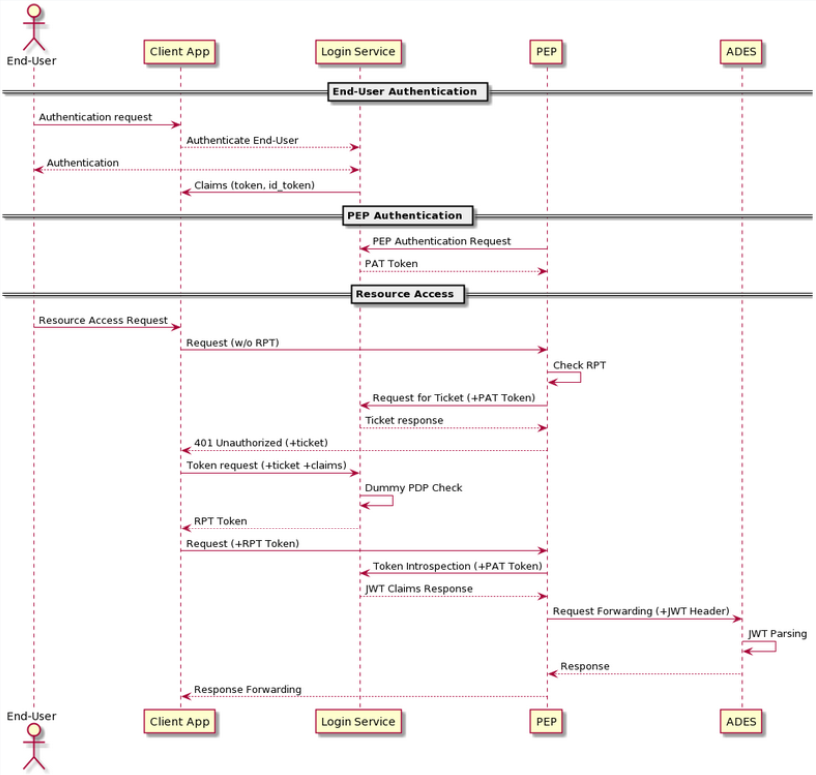

[[mainComponents]]
= Design

== Building Block Design

[NOTE]
.Content Description
================================
This section contains:

* A concise breakdown of the Building Block in several independent services (when applicable). For each component, the following subsections are added:
** Overview and purpose: indicating the functionality covered by the component
** SW Reuse and Dependencies: indicating reuse of third party open source solutions (if any) and any pre-required Dependencies
** Interfaces: both internal to the building block and those exposed externally
** Data: Data usage of the building block, data flow and any GDPR concerns should be addressed here
** Applicable Resources: links and references to (Reference Docs), and repositories.

When a breakdown is necessary, a general overview of the building block can be given. On the contrary, no breakdown indicates a single component development with the same expected sections.

================================


== Reverse Proxy Service
=== Overview and Purpose
The Flask-based reverse proxy serves as the interface for input queries. This reverse proxy is in charge of receiving the queries and returning the appropiate HTTP response.

This is the default behaviour of the PEP when working in FULL mode. There is an alternate mode, PARTIAL, where the reverse proxy functionality is delegated to an external nginx instance, and the PEP itself works in an authorization api fashion, validating RPTs and issuing access tickets for requests, informing the caller of the result of said actions.

=== Software Reuse and Dependencies

All requirements for the executing of the reverse proxy are found under src/requirements.txt, and expect Python 3.6.9 or greater to work.

The most important are:

* **EOEPCA-SCIM**: Used to auto-register itself as a client to the Auth. Server upon startup
* **EOEPCA-UMA**: Used as the backbone of the PEP, allows for generation of tickets, verification of RPTs, and any other UMA-related action.
* **EOEPCA-OIDC**: Used to generate PAT tokens, validate OAuth tokens and JWTs.
* **WellKnownHandler**: Used to dynamically check the configuration of the Authorization Server on each execution. For example, it can get the needed endpoints for any API the PEP needs, such as the token request for OIDC.
* **Flask**: External to EOEPCA's project, this library allows the PEP to create the actual reverse proxy, sending and recieving custom requests.
* **MongoDB**: Used to store the resources and user identifications

=== Interfaces

This component doesn't have any internal interfaces. For a reference of external interfaces see <<External Interfaces>> on Section 2 <<Overview>>

=== Data

==== Configuration

The PEP gets all its configuration from the files located under `config/*.json`.

The parameters that are accepted, and their meaning, are as follows. For the `config.json` file:

- **realm**: 'realm' parameter answered for each UMA ticket. Default is "eoepca"
- **auth_server_url**: complete url (with "https") of the Authorization server.
- **service_host**: Host for the proxy to listen on. For example, "0.0.0.0" will listen on all interfaces
- **proxy_service_port**: Port for the proxy to listen on. By default, **5566**. Keep in mind you will have to edit the docker file and/or kubernetes yaml file in order for all the prot forwarding to work.
- **resources_service_port**: Port for the resources to listen on. By default, **5576**. Keep in mind you will have to edit the docker file and/or kubernetes yaml file in order for all the prot forwarding to work.
- **s_margin_rpt_valid**: An integer representing how many seconds of "margin" do we want when checking RPT. For example, using **5** will make sure the provided RPT is valid now AND AT LEAST in the next 5 seconds.
- **rpt_limit_uses**: Number of uses for each of the RPTs.
- **check_ssl_certs**: Toggle on/off (bool) to check certificates in all requests. This should be forced to True in a production environment
- **use_threads**: Toggle on/off (bool) the usage of threads for the proxy. Recommended to be left as True.
- **debug_mode**: Toggle on/off (bool) a debug mode of Flask. In a production environment, this should be false.
- **resource_server_endpoint**: Complete url (with "https" and any port) of the Resource Server to protect with this PEP.
- **verify_signature**: Toggle on/off (bool) the usage of signature validation for the JWT.
- **working_mode**: PEP working mode, FULL or PARTIAL.
- **client_id**: string indicating a client_id for an already registered and configured client. **This parameter is optional**. When not supplied, the PEP will generate a new client for itself and store it in this key inside the JSON.
- **client_secret**: string indicating the client secret for the client_id. **This parameter is optional**. When not supplied, the PEP will generate a new client for itself and store it in this key inside the JSON.

===== Default HTTP scopes

To extend the granularity of the PDP policy checks, the PEP can append extra UMA scopes to a registering resource that correspond to supported HTTP verbs. Currently, the PEP supports GET, HEAD, POST, PUT, PATCH and DELETE verbs. For the `verb_config.json` file:

- **default_scopes**: A list of default scopes that will be registered for HTTP actions, for PDP functionality. These must match the scopes existing on the Login Service's persistence repository.
- **list of scope-action associations**: for each of the scopes specified in the above list, there will be one entry with an associanted action-id, e.g. `"protected_get": "get"`

===== Default resources registration

The PEP reads the definition of the default resources inserted in the database from the file located under `config/default-resources.json` of the source path, but also has its own definition under the path `charts/pep-engine/scripts/default-resources.json`.

The first option usage is mainly for a local deployment using Docker and a local image built from the um-pep-engine repository with no help of Helm Charts.
The second option is for a Helm Chart deployment which will mount the file as a volume directly into the `/data` path of the container. Notice that if this second option of deployment is followed, the unique resources for both files will be added to the database.

An example of default resources would be as follows:

```
{
  "default_resources": [
    {"name": "Sample Resource", resource_uri": "/", "scopes": "protected_access", "default_owner": <uuid>, "T&C": []},
    {"name": "Sample Resource", resource_uri": "/workspace", "scopes": "protected_access", "default_owner": <uuid>, "T&C": []}
  ]
}
```

* Mandatory Parameters:

- **name**: String Value

- **resource_uri**: String Value 

- **scopes**: String Value

* Optional Parameters (default values):

- **default_owner**: String Value -> `"0000000000000"`

- **description**: String Value -> `"Default description"`


==== Data flow

The only information the PEP handles are tickets given by the Auth Server, and RPTs which are sent only to the Auth Server.

All data is ephimeral at the time of writting, except the data stored at the config file. The resources are loaded into a mongo database, this allows to store large amounts of resources and more complex queries.

What follows is an example of the nominal flow for the PEP, and "ADES" is the Resource Server the PEP is protecting:




=== Extensibility

The design of the PEP allows for further improvements if need be. For example:

- The resource management in memory could be expanded to a full on DB, by changing how the UMA handler works internally.
- The UMA library used allows for quick implementations for resource managing, such as creation, deleting and editing.
- The proxy can be expanded to parse further parameters on top of the HTTP protocol, allowing for any kind of plugin or complex mechanism desired.

=== Applicable Resources

* UMA 2.0 Specification - https://docs.kantarainitiative.org/uma/wg/rec-oauth-uma-grant-2.0.html
* EOEPCA's SCIM Client - https://github.com/EOEPCA/um-common-scim-client
* EOEPCA's UMA Client - https://github.com/EOEPCA/um-common-uma-client
* EOEPCA's Well Known Handler - https://github.com/EOEPCA/well-known-handler
* Flask - https://github.com/pallets/flask


== Resource Repository
=== Overview and Purpose
It is the database based on MongoDB where the resources are stored and queried for the PEP pourposes

Included with the PEP there is a script at the source path that performs queries against a Mongo Database. The main purpose of this script is to reduce the usage of RAM when registering a resource locally and when querying for its content.
It is developed to generate a database called 'resource_db' in case it does not exist. The collection used for the storage of the documents is called 'resources'.
The script defines methods to:

* **Insert resource data**: Generates a document with the resource data received as input and if it already exists, it gets updated. The main parameters of the resource would be an auto-generated id provided by mongo which identify each document in the database, the resource ID provided by the login-service, and the match url which will define the endpoint of the resource. This would be mandatory parameters in order to perform other kind of queries. For updated operations, it is also capable of querying the OIDC endpoint of the Authorization Server to query if the request was performed by a valid resource operator. As an operator all resources are available for register and update, but in case the one registering a resource is a user, it will need to ask for an operator to first register a resource in its name. After that all resources derived from the resource asigned will be allowed to register by taht user.
* **Get the ID from a URI**: Returns the id for the best candidate of the match by a given URI.
* **Delete resources**: Receives a resource id and will find and delete the matched document, if the requesting user is a valid resource operator.

This script is manipulated by the API which would intercept the request in order to perform PUT, POST, HEAD PATCH and DELETE methods.
The GET method would be called by the reverse proxy since it will be in charge of filtering the resource with the given URI.
When the PEP registered a new resource this resource will contains additional scopes, one for each available HTTP action in a protected_xxx format: GET, HEAD, PUT, POST, PATCH and DELETE. These default scopes, and the associated action-ids for PDP functions, can be edited in a `verb_config.json` file. 
These scopes will be used to the generation of a ticket and therefore in the PDP interface to allow or deny access to a resource.

=== Data flow

The database will only be accesible by the API or the Proxy.
The main methods for the interaction with the database are displayed in this dataflow as a summary of its scope:


=== Applicable Resources

* MongoDB image from DockerHub - https://hub.docker.com/_/mongo

== Resource default Protection Policy
=== Overview and Purpose
Together with the Resource Repository, the PEP will also contact the Policy Decision Point in order to register two protection policies for the resource.
One with the scope of 'protection_read' related to the requests to the PEP endopoint with HTTP verbs HEAD and GET.
And one with the scope of 'protection_write' which is related to the requests to the PEP with the HTTP verbs PUT, POST and DELETE.

This call to `<pdp_url>/policy` will include a preset policy configuration, to be applied to the registering resource. It stands as follows:
```
{"name": "Default Ownership Policy of <resource_id> with action <action type depends on type of scope> ",
 "description": "This is the default ownership policy for created resources through PEP",
  "config": {"resource_id": resource_id,
             "rules": [ { "AND": [ { "EQUAL": { "user_name" : user_name }}]}]
            },
   "scopes": ["protected_read"]}
```

=== Data flow

This subroutine is triggered by the successful registration of the resource.

=== Applicable Resources

* EOEPCA's Policy Decision Point - https://github.com/EOEPCA/um-pdp-engine

== Logging
=== Design

Logging accross the EOEPCA Building Blocks works much in the same way, by usage of a log helper class to initiate a Python logger, handler and formater that simultaneously outputs log messages to console and a log file. These log files are set on a rotation, with a 1GB limit per each, with the 10 latest log files being kept in memory.

A new configuration yaml file is added to the building block, containing initialization parameters.

=== Log message format

INFO level log messages follow the following format:

 * TIME: in ISO 8601 format, "%Y-%m-%dT%H:%M:%S%z"
 * LEVELNAME: INFO by default
 * COMPONENT: "PEP"
 * SUBCOMPONENT: PROXY or RESOURCES
 * ACTION IDENTIFIER: HTTP by default
 * ACTION TYPE:  HTTP method used
 * LOG CODE: Unique code identifying log message type
 * ACTIVITY: Detailed log message, check reference table

=== Log message codes

Subcomponent division is as follows:

 * 20xx: RESOURCES
 * 21xx: PROXY
 
.Log Codes
|===
|Log Code |Structure

|2001
| {"Description":"No token found/error reading token"}

|2002
| {"Description":"User not found in token"}

|2103
| {"User":user,"Description":"Token validated, forwarding to RM"}

|2104
| {"Ticket":ticket,"Description":"Invalid token, generating ticket for resource:"+resource_id}

|2105
| {"User":user,"Description":"No resource found, forwarding request for path "+path}

|2106
| {"User":user,"Description":"Error while redirecting to resource: "+str(exception)}

|2007
| {"User":user,"Description":"Returning resource list: "+resource_list}

|2008
| {"User":user,"Description":"No matching resources found for requested path "+path}

|2009
| {"User":user,"Description":"Resource created","Resource_id":resource_id,"Write Policy":write_policy_id,"Read Policy":read_policy_id}

|2010
| {"User":user,"Description":"Error occured: +"error}

|2011
| {"User":user,"Description":"Operation successful","Resource":resource}

|2012
| {"User":user,"Description":"Resource "+resource_id+" deleted"}

|2013
| {"User":user,"Description":"No matching resources found for requested path "+path}

|2014
| {"User":user,"Description":"User not authorized for resource management","Resource":resource_id}

|===
